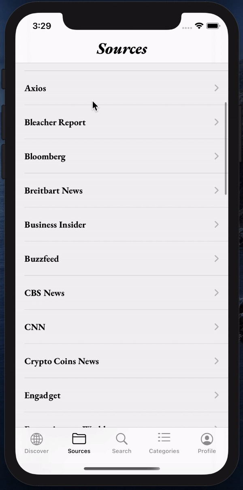

# Newsly - News app using VIPER iOS
> Newsly is a news app fetching data from the "newsApi" and displaying it and few modes.The project was made with Viper Architecture.

## Table of contents
* [General info](#general-info)
* [Screenshots](#screenshots)
* [Setup](#Setup)
* [Technologies](#technologies)
* [Features](#features)
* [Status](#status)
* [Contact](#contact)

## General info
Newsly app is a news app where you get the latest news, as well as news by categories and also you could save your favourite articles.

## Setup:

1. [Get your News API key](https://newsapi.org)

2. [Get your google.plist file](https://www.googleadservices.com/pagead/aclk?sa=L&ai=DChcSEwjz1-3U16rsAhVE3dUKHXjzD8YYABAAGgJ3cw&ohost=www.google.com&cid=CAESQOD2p4915hCOcLEoSbb3g8Pul5Ed_OrMHAdIzOvSF4d-QNrb_9gousJb398STrH-JqFm4_K2fd2hIM07otFwCsM&sig=AOD64_1owLXQ__dQ4hr-W1rkFRiILT5z-A&q&adurl&ved=2ahUKEwivpuPU16rsAhWFzoUKHV2dAfAQ0Qx6BAggEAE)

3. Insert your key into Container.swift file

4. Inject your google.plist file to your project

5. Run app

## Screenshots

## Technologies
* Xcode 12.0
* Swift
* UIKit
* SnapKit
* KingFisher
* Public APIs
* VIPER
* Networking
* Firebase Auth
* Firebase Storage
* Firebase Firestore

## Features
List of features ready and TODOs for future development
* Sign up / Sign in / Sign out including user's image
* Save favourite articles
* Query favourite articles
* Discover news by topics
* Search for specific topic

To-do list:
* Add more alerts to the user

## Status
Project is: _finished_

## Contact
Created by [@ebubedimobi],[@meitarbass] - feel free to contact me!
